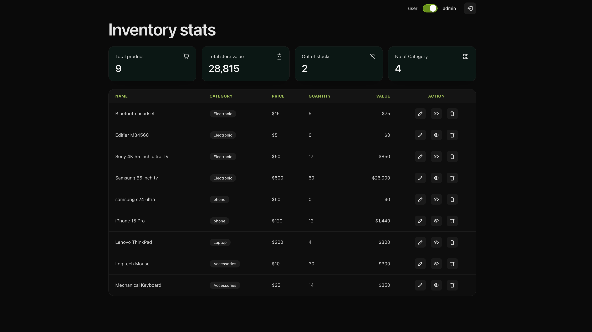
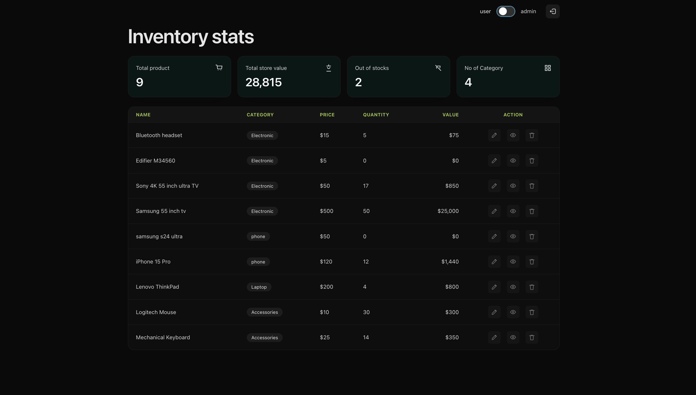
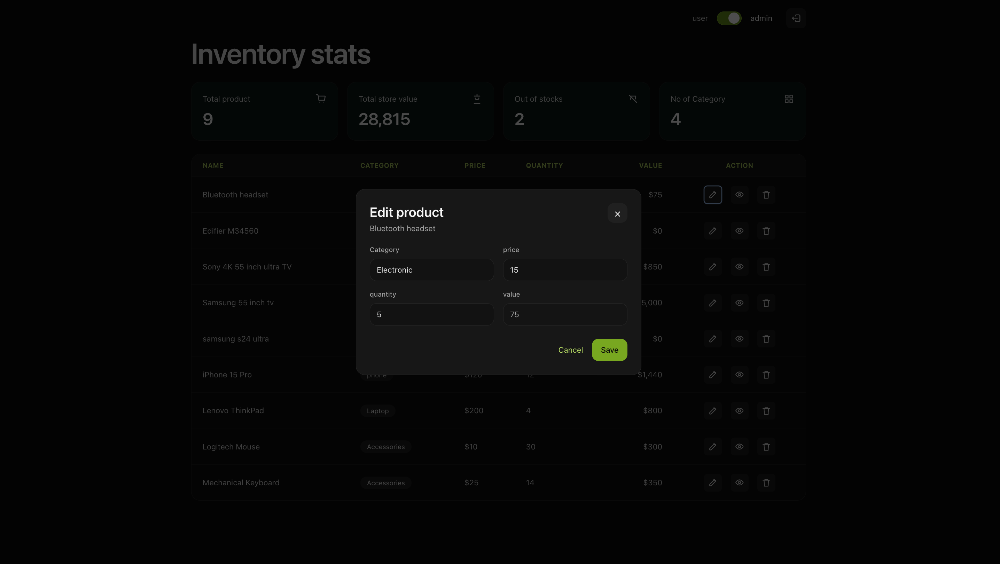

# Inventory Management App

A simple inventory management web application built with React, TypeScript, and Tailwind CSS. This app allows users to view, edit, delete, and disable products in an inventory system with separate Admin and User views.





---

## Features

### Admin View

- **Edit Product**: Click the pencil icon to open a popup modal where you can edit category, price, and quantity. Value is auto-calculated.
- **Delete Product**: Click the trash icon to remove a product from the inventory.
- **Disable/Enable Product**: Click the eye icon to toggle product visibility. Disabled products show a crossed-eye icon and can be re-enabled by clicking again.

### User View

- **View Only**: Users can see all products but cannot perform any actions.
- **Disabled Actions**: All action buttons (edit, delete, disable) are disabled in user mode.

### Top Widgets (Auto-Updated)

- **Total Products**: Count of all active (non-disabled) products
- **Total Store Value**: Sum of (price × quantity) for all active products
- **Out of Stock**: Count of products with quantity = 0
- **No. of Categories**: Count of unique categories

### Validation

- **Value Zero Error**: Edit modal shows error and blocks save if calculated value is 0

---

## Tech Stack

| Technology        | Purpose                  |
| ----------------- | ------------------------ |
| **React 19**      | UI Framework             |
| **TypeScript**    | Type Safety              |
| **Vite**          | Build Tool               |
| **Tailwind CSS**  | Styling                  |
| **Redux Toolkit** | State Management (Bonus) |

---

## Project Structure

```
src/
├── core/                    # App shell, layout, store
│   ├── App.tsx
│   ├── store.ts             # Redux store configuration
│   ├── hooks.ts             # Typed Redux hooks
│   └── layout/
│       ├── AppLayout.tsx
│       └── TopNav.tsx       # Admin/User toggle
├── features/
│   ├── inventory/           # Inventory feature
│   │   ├── InventoryPage.tsx
│   │   ├── inventorySlice.ts  # Redux slice
│   │   ├── types.ts
│   │   ├── utils.ts
│   │   └── components/
│   │       ├── StatsGrid.tsx      # Top 4 widgets
│   │       ├── ProductTable.tsx   # Product table with actions
│   │       └── EditProductModal.tsx
│   └── ui/
│       └── uiSlice.ts       # UI state (admin/user mode)
└── shared/
    ├── api/
    │   ├── inventory.ts     # API fetch with fallback
    │   └── mockInventory.ts # Fallback mock data
    └── types/
        ├── inventory.ts
        └── viewMode.ts
```

---

## Getting Started

### Prerequisites

- Node.js 18+ (recommended: 20+)
- npm or yarn

### Installation

```bash
# Clone the repository
git clone https://github.com/Kushagra-234/Lucidity.git
cd Lucidity

# Install dependencies
npm install

# Start development server
npm run dev
```

### Build for Production

```bash
npm run build
npm run preview
```

---

## API

**Endpoint**: `https://dev-0tf0hinghgjl39z.api.raw-labs.com/inventory`  
**Method**: GET

> **Note**: If the API is unavailable (DNS issues), the app automatically falls back to local mock data.

---

## Assignment Requirements Checklist

| Requirement                                | Status |
| ------------------------------------------ | ------ |
| API call to fetch inventory                | ✅     |
| Top 4 widgets with calculated values       | ✅     |
| Product table with action icons            | ✅     |
| Admin/User toggle switch                   | ✅     |
| Admin: Delete product                      | ✅     |
| Admin: Edit product (popup modal)          | ✅     |
| Admin: Disable/Enable product (eye toggle) | ✅     |
| Local state updates (no API for update)    | ✅     |
| Widgets auto-update on changes             | ✅     |
| User: All actions disabled                 | ✅     |
| **Bonus**: Redux Toolkit state management  | ✅     |
| React + TypeScript                         | ✅     |
| Tailwind CSS styling                       | ✅     |

---

## Screenshots

### Admin View


### User View


### Edit Product Modal


---

## License

This project is for assessment purposes.

---

<p align="center">Made with ❤️ by <strong>Kushagra Gupta</strong></p>
